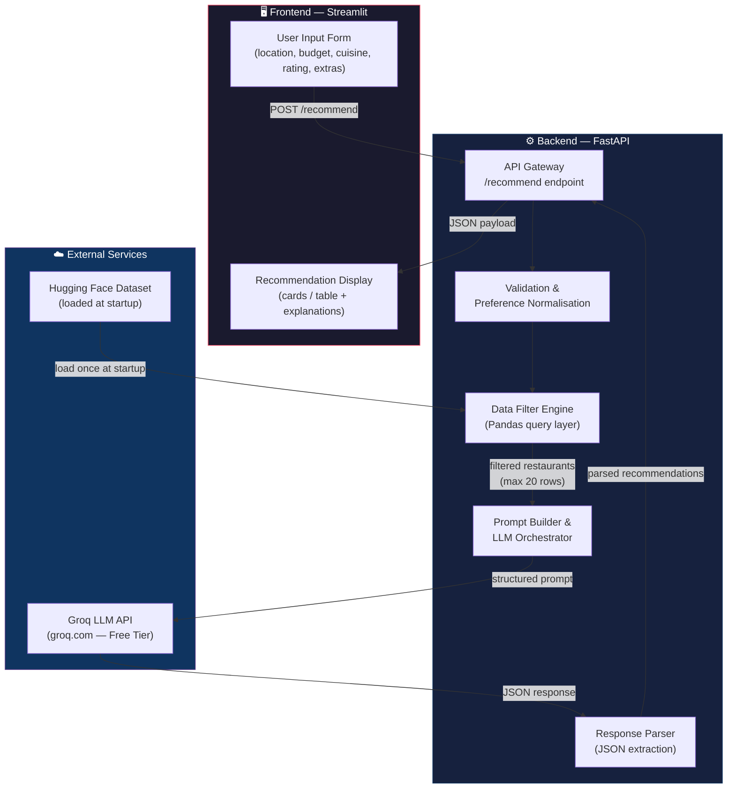
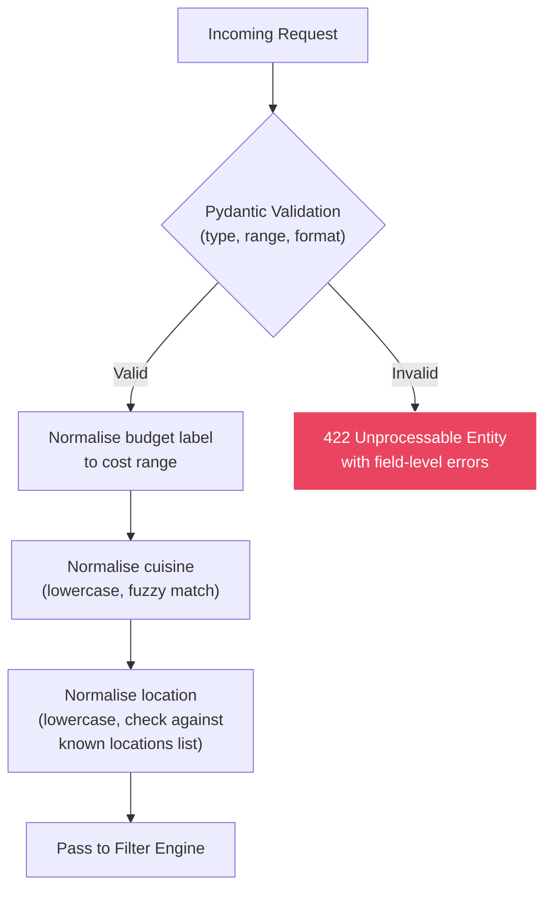
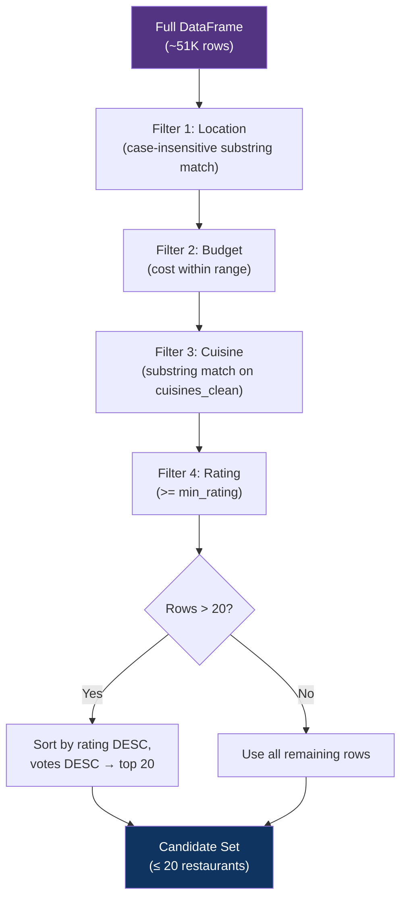
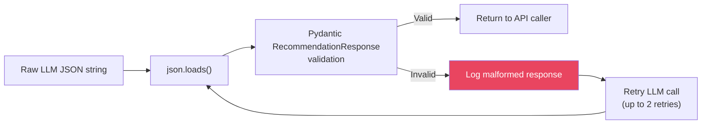
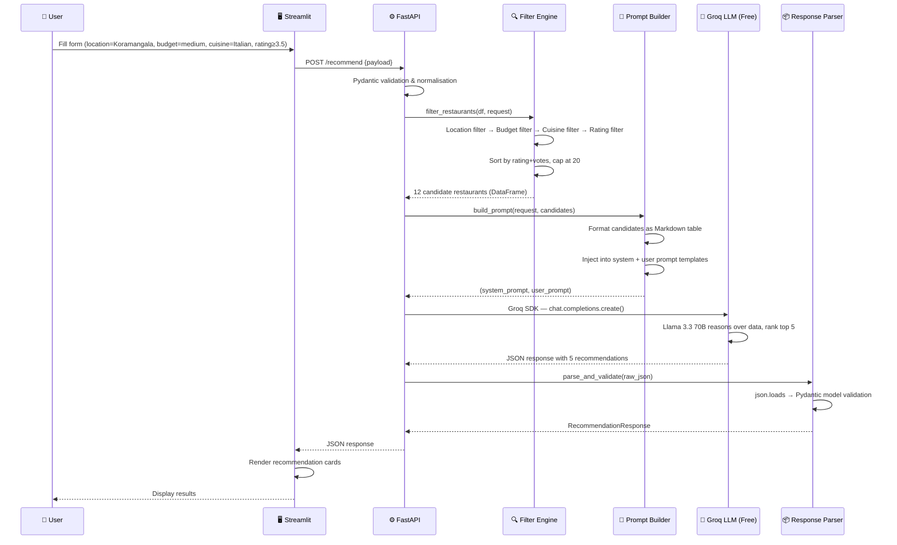
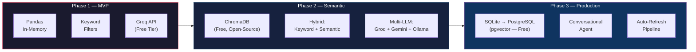

# SmartDine — Technical Architecture Document

> **Version:** 1.0  
> **Last Updated:** 2026-06-14  
> **Status:** Draft — Pending Team Review  
> **Source:** [context.md](file:///c:/Users/panka/Documents/Pankaj_CodeSpace/AI_Projects/SmartDine/docs/context.md)

---

## Table of Contents

1. [System Overview](#1-system-overview)
2. [High-Level Architecture](#2-high-level-architecture)
3. [Proposed Technology Stack](#3-proposed-technology-stack)
4. [Detailed Component Architecture](#4-detailed-component-architecture)
5. [Data Flow — Step-by-Step](#5-data-flow--step-by-step)
6. [Scalability & Future Enhancements](#6-scalability--future-enhancements)

---

## 1. System Overview

**SmartDine** is an AI-powered restaurant recommendation system inspired by Zomato. It combines structured tabular data (the [ManikaSaini/zomato-restaurant-recommendation](https://huggingface.co/datasets/ManikaSaini/zomato-restaurant-recommendation) dataset from Hugging Face) with a Large Language Model (LLM) to deliver personalised, human-readable dining suggestions.

### Primary Goals

| Goal | Description |
|---|---|
| **Personalisation** | Tailor recommendations to individual preferences — location, budget, cuisine, rating, and qualitative needs (e.g. "family-friendly"). |
| **Explainability** | Provide a natural-language *reason* for every recommendation, not just a ranked list. |
| **Efficiency** | Pre-filter structured data *before* hitting the LLM so that we stay well within context-window limits and keep latency under 5 seconds per request. |
| **Extensibility** | Design the system so it can later support vector search, user history, caching, and real-time dataset updates with minimal refactoring. |

---

## 2. High-Level Architecture

The system follows a **three-tier architecture**: a frontend presentation layer, a backend API/orchestration layer, and external services (dataset store + LLM provider).



### Interaction Summary

| Step | Component | Action |
|---|---|---|
| 1 | **Frontend** | User fills in preferences and submits. |
| 2 | **API Gateway** | Receives the request, validates input schema. |
| 3 | **Validation** | Normalises values (e.g., maps "cheap" → budget range ₹0–₹300). |
| 4 | **Data Filter Engine** | Queries the in-memory Pandas DataFrame using the normalised filters. Returns ≤ 20 candidate restaurants. |
| 5 | **Prompt Builder** | Constructs a structured prompt containing the user's intent **and** the filtered restaurant data as a Markdown table. |
| 6 | **LLM (Groq / Llama 3)** | Receives the prompt, reasons over the data, returns a JSON array of ranked recommendations with explanations. |
| 7 | **Response Parser** | Extracts and validates the JSON from the LLM's response. |
| 8 | **Frontend** | Renders the final recommendations as rich cards with explanations. |

---

## 3. Proposed Technology Stack

### Core Stack

| Layer | Technology | Rationale |
|---|---|---|
| **Frontend / UI** | [Streamlit](https://streamlit.io/) | Rapid prototyping, native Python, built-in widgets for forms and data display. Zero JS required. |
| **Backend / API** | [FastAPI](https://fastapi.tiangolo.com/) | Async-first, auto-generated OpenAPI docs, Pydantic validation, high performance. |
| **Data Processing** | [Pandas](https://pandas.pydata.org/) + HF [`datasets`](https://huggingface.co/docs/datasets/) | `datasets` loads the Hugging Face dataset; Pandas handles filtering, cleaning, and aggregation in-memory. |
| **LLM Integration** | [Groq API](https://console.groq.com/) + **Llama 3.3 70B** | 100% free tier (no credit card), OpenAI-compatible SDK, ultra-fast inference (~500 tokens/sec), JSON mode support. |
| **Configuration** | [python-dotenv](https://pypi.org/project/python-dotenv/) + `pydantic-settings` | Secrets (API keys) via `.env`; all config validated at startup. |

### Supporting Libraries

| Library | Purpose |
|---|---|
| `groq` | Official Groq Python SDK — OpenAI-compatible, async support. |
| `uvicorn` | ASGI server for FastAPI. |
| `pydantic` | Request/response schema validation. |
| `tenacity` | Retry logic with exponential backoff for LLM calls. |
| `pytest` + `pytest-asyncio` | Unit and integration testing. |

### Deployment Topology (Development)

```
┌────────────────────┐       ┌────────────────────┐       ┌─────────────────────┐
│  Streamlit App     │──────▶│  FastAPI Server     │──────▶│  Groq API (FREE)    │
│  (localhost:8501)  │       │  (localhost:8000)   │       │  Llama-3.3-70b      │
└────────────────────┘       └────────┬───────────┘       │  (api.groq.com)     │
                                      │                    └─────────────────────┘
                              ┌───────▼────────┐
                              │ In-Memory       │
                              │ Pandas DataFrame│
                              │ (loaded at init) │
                              └────────────────┘
```

---

## 4. Detailed Component Architecture

### 4.1 Data Ingestion Module

#### Dataset Schema

The Hugging Face dataset `ManikaSaini/zomato-restaurant-recommendation` contains the following columns (extracted from the Croissant metadata):

| Column | Type | Description | Used? |
|---|---|---|---|
| `url` | `string` | Zomato listing URL | ❌ (not exposed to user) |
| `address` | `string` | Full street address | ✅ supplementary location info |
| `name` | `string` | Restaurant name | ✅ **primary** |
| `online_order` | `string` | Accepts online orders? (Yes/No) | ✅ filter |
| `book_table` | `string` | Table booking available? (Yes/No) | ✅ filter |
| `rate` | `string` | Rating string (e.g., "4.1/5") | ✅ **primary** — needs parsing |
| `votes` | `int64` | Number of user votes | ✅ popularity signal |
| `phone` | `string` | Contact number | ❌ |
| `location` | `string` | Neighbourhood / area name | ✅ **primary** — location filter |
| `rest_type` | `string` | Restaurant type (e.g., "Casual Dining") | ✅ filter (maps to "additional preferences") |
| `dish_liked` | `string` | Popular dishes | ✅ enrichment for LLM prompt |
| `cuisines` | `string` | Comma-separated cuisine types | ✅ **primary** — cuisine filter |
| `approx_cost(for two people)` | `string` | Cost as string (e.g., "800") | ✅ **primary** — budget filter, needs parsing |
| `reviews_list` | `string` | Raw review text | ❌ (too large for prompt; future use) |
| `menu_item` | `string` | Menu items | ❌ (future use) |
| `listed_in(type)` | `string` | Meal type (Buffet, Delivery, etc.) | ✅ supplementary |
| `listed_in(city)` | `string` | City-level location | ✅ supplementary |

#### Loading & Cleaning Pipeline


#### Key Design Decisions

| Decision | Reasoning |
|---|---|
| **In-memory Pandas** (not a database) | The dataset is ~51K rows — small enough to fit comfortably in RAM. Avoids operational overhead of a database for an MVP. |
| **Load once at startup** | The dataset is static. We load it when the FastAPI app initialises (`lifespan` event) and keep it as a module-level singleton. |
| **Eager cleaning** | All parsing (rate → float, cost → int) happens at load time, not per-request, to minimise latency. |

#### Implementation Skeleton

```python
# src/data/ingestion.py

import pandas as pd
from datasets import load_dataset

def load_and_clean() -> pd.DataFrame:
    """Load the Zomato dataset from HF and return a cleaned DataFrame."""
    ds = load_dataset("ManikaSaini/zomato-restaurant-recommendation", split="train")
    df = ds.to_pandas()

    # De-duplicate
    df = df.drop_duplicates(subset=["name", "location"])

    # Parse rating: "4.1/5" → 4.1, handle "NEW", "-", NaN
    df["rating"] = (
        df["rate"]
        .str.extract(r"(\d+\.?\d*)")
        .astype(float)
    )

    # Parse cost: "1,200" → 1200
    df["cost"] = (
        df["approx_cost(for two people)"]
        .str.replace(",", "", regex=False)
        .astype(float)
    )

    # Normalise cuisines
    df["cuisines_clean"] = df["cuisines"].str.lower().str.strip()

    # Drop rows where essential fields are missing
    df = df.dropna(subset=["name", "location", "rating", "cost"])

    return df
```

---

### 4.2 User Input & API Layer

#### Input Schema

User preferences are captured via a Pydantic model:

```python
# src/api/schemas.py

from pydantic import BaseModel, Field
from typing import Optional

class RecommendationRequest(BaseModel):
    location: str = Field(..., example="Koramangala", description="Neighbourhood or city")
    budget: str = Field(..., example="medium", description="low | medium | high")
    cuisine: Optional[str] = Field(None, example="Italian", description="Preferred cuisine type")
    min_rating: float = Field(3.5, ge=0.0, le=5.0, description="Minimum acceptable rating")
    extras: Optional[str] = Field(None, example="family-friendly, table booking", description="Free-text additional preferences")
    top_n: int = Field(5, ge=1, le=10, description="Number of recommendations to return")
```

#### Budget Mapping

Since the dataset stores `approx_cost(for two people)` as an integer (INR), we define explicit budget ranges:

| Budget Label | Cost Range (₹ for two) |
|---|---|
| `low` | ₹0 – ₹300 |
| `medium` | ₹301 – ₹800 |
| `high` | ₹801+ |

These thresholds are **configurable** via environment variables.

#### API Endpoint

```python
# src/api/routes.py

from fastapi import APIRouter, Depends
from .schemas import RecommendationRequest, RecommendationResponse

router = APIRouter()

@router.post("/recommend", response_model=RecommendationResponse)
async def get_recommendations(request: RecommendationRequest):
    # 1. Validate & normalise
    # 2. Filter dataset
    # 3. Build prompt & call LLM
    # 4. Parse response
    # 5. Return
    ...
```

#### Validation Strategy



---

### 4.3 Integration Layer — Data Filter Engine

The filter engine is the **critical optimisation layer**. Its job is to reduce ~51K rows to a small, highly relevant candidate set (≤ 20 restaurants) *before* we spend tokens on the LLM.

#### Filtering Strategy

Filters are applied in a **cascade** (most selective first):



#### Fallback Strategy

If any filter stage returns **zero** results, we apply **progressive relaxation**:

1. Remove the cuisine filter → retry.
2. Widen the budget range by one tier → retry.
3. Broaden location to city-level (`listed_in(city)`) instead of neighbourhood.
4. If still empty, return a "No exact matches" message with the *closest* results based on location alone.

#### Implementation Skeleton

```python
# src/core/filter_engine.py

import pandas as pd
from src.api.schemas import RecommendationRequest

BUDGET_RANGES = {
    "low": (0, 300),
    "medium": (301, 800),
    "high": (801, float("inf")),
}

def filter_restaurants(df: pd.DataFrame, req: RecommendationRequest) -> pd.DataFrame:
    """Apply cascaded filters and return ≤ 20 candidate restaurants."""
    result = df.copy()

    # Location filter
    result = result[result["location"].str.lower().str.contains(req.location.lower())]

    # Budget filter
    low, high = BUDGET_RANGES[req.budget]
    result = result[(result["cost"] >= low) & (result["cost"] <= high)]

    # Cuisine filter (optional)
    if req.cuisine:
        result = result[result["cuisines_clean"].str.contains(req.cuisine.lower())]

    # Rating filter
    result = result[result["rating"] >= req.min_rating]

    # Cap at 20, prioritising high rating and popularity
    result = result.sort_values(["rating", "votes"], ascending=[False, False]).head(20)

    return result
```

---

### 4.4 Recommendation Engine — LLM & Prompt Engineering

#### Provider: Groq (groq.com) — 100% Free Tier

> **Why Groq?** Groq offers a completely free API tier with no credit card required. It runs open-source Llama 3 models at exceptionally high speeds (~500 tokens/sec), making it ideal for a low-latency recommendation system.

| Property | Value |
|---|---|
| **API Base URL** | `https://api.groq.com/openai/v1/chat/completions` |
| **Model** | `llama-3.3-70b-versatile` (free — best quality) |
| **Fallback Model** | `llama3-8b-8192` (free — faster, lower latency) |
| **Auth** | Bearer token via `GROQ_API_KEY` env var |
| **SDK** | `groq` Python package (OpenAI-compatible interface) |
| **Response Format** | JSON mode enabled (`response_format: { type: "json_object" }`) |
| **Free Tier Limits** | 14,400 requests/day, 6,000 tokens/min — ample for development & demo |
| **Sign-up** | [console.groq.com](https://console.groq.com/) — instant access, no billing required |

#### Prompt Engineering Strategy

The prompt follows a **System / User** message pattern:

**System Prompt** — defines the persona, output schema, and ranking criteria:

```text
You are SmartDine, an expert restaurant recommendation engine.

You will receive:
1. A user's dining preferences.
2. A table of candidate restaurants (pre-filtered from a larger dataset).

Your task:
- Analyse each candidate against the user's preferences.
- Rank the top {top_n} restaurants.
- For each, provide a concise explanation of WHY it's a good fit.

Respond ONLY with a JSON object in this exact schema:
{
  "recommendations": [
    {
      "rank": 1,
      "name": "Restaurant Name",
      "cuisine": "Cuisine Type",
      "rating": 4.5,
      "cost_for_two": 600,
      "explanation": "One-paragraph explanation of why this restaurant fits the user's needs."
    }
  ]
}

Ranking criteria (in order of priority):
1. How well the cuisine matches the user's preference.
2. Rating (higher is better).
3. Cost alignment with stated budget.
4. Relevance of any additional preferences (e.g., "family-friendly" → look for "Casual Dining" or "book_table = Yes").
5. Popularity (vote count).

Do NOT include restaurants that are clearly irrelevant.
Do NOT invent data — use only the provided table.
```

**User Prompt** — injects the actual data:

```text
## User Preferences
- Location: {location}
- Budget: {budget} (₹{cost_low}–₹{cost_high} for two)
- Cuisine: {cuisine}
- Minimum Rating: {min_rating}
- Additional: {extras}

## Candidate Restaurants
| Name | Location | Cuisines | Rating | Cost (₹ for 2) | Type | Book Table | Popular Dishes |
|------|----------|----------|--------|-----------------|------|------------|----------------|
{rows_as_markdown_table}

Please rank the top {top_n} restaurants and explain your reasoning.
```

#### Why This Prompt Design Works

| Design Choice | Benefit |
|---|---|
| **Structured output schema in system prompt** | Enables deterministic JSON parsing; avoids free-form text that's hard to extract. |
| **Markdown table for data injection** | Compact token-efficient representation of tabular data; LLMs handle Markdown tables well. |
| **Explicit ranking criteria** | Reduces hallucination by giving the LLM a clear decision framework. |
| **"Do NOT invent data" guard-rail** | Prevents the LLM from hallucinating restaurant names or ratings not in the table. |
| **Pre-filtered data (≤ 20 rows)** | Keeps the prompt within ~2K tokens even for the maximum candidate set, leaving ample room for the model's reasoning. |

#### Token Budget Estimate

| Component | Est. Tokens |
|---|---|
| System prompt | ~250 |
| User preferences | ~80 |
| Candidate table (20 rows × 8 cols) | ~800 |
| **Total Input** | **~1,130** |
| Expected Output (5 recommendations) | ~500 |
| **Total Round-Trip** | **~1,630** |

This is well within the free-tier limits and keeps latency low.

#### LLM Client Implementation

```python
# src/core/llm_client.py

import json
import os
from groq import AsyncGroq
from tenacity import retry, stop_after_attempt, wait_exponential

# Groq is FREE — sign up at console.groq.com, no credit card needed
DEFAULT_MODEL = "llama-3.3-70b-versatile"   # Best quality (free)
FALLBACK_MODEL = "llama3-8b-8192"           # Faster fallback (free)

@retry(stop=stop_after_attempt(3), wait=wait_exponential(min=1, max=10))
async def call_llm(system_prompt: str, user_prompt: str, api_key: str) -> dict:
    """Call the Groq API (free tier) and return the parsed JSON response."""
    client = AsyncGroq(api_key=api_key)

    response = await client.chat.completions.create(
        model=os.getenv("LLM_MODEL", DEFAULT_MODEL),
        messages=[
            {"role": "system", "content": system_prompt},
            {"role": "user", "content": user_prompt},
        ],
        response_format={"type": "json_object"},
        temperature=0.3,
        max_tokens=1024,
    )

    content = response.choices[0].message.content
    return json.loads(content)
```

---

### 4.5 Output Parsing & Display

#### Response Validation

The raw LLM JSON response is validated against a Pydantic model:

```python
# src/api/schemas.py

from pydantic import BaseModel
from typing import List

class Recommendation(BaseModel):
    rank: int
    name: str
    cuisine: str
    rating: float
    cost_for_two: int
    explanation: str

class RecommendationResponse(BaseModel):
    recommendations: List[Recommendation]
    query_metadata: dict  # echo back the original filters for transparency
```

#### Parsing Pipeline



#### Frontend Display (Streamlit)

The Streamlit frontend renders each recommendation as a **card** with:

```
┌──────────────────────────────────────────────────────────┐
│  🥇  #1 — The Pizza Place                               │
│  ─────────────────────────────────────────────────────── │
│  🍕 Cuisine: Italian, Continental                        │
│  ⭐ Rating: 4.6 / 5  (1,230 votes)                      │
│  💰 Approx. Cost: ₹650 for two                          │
│  ─────────────────────────────────────────────────────── │
│  💡 Why this recommendation?                             │
│  "This restaurant perfectly matches your preference for  │
│   Italian cuisine in Koramangala. With a 4.6 rating and  │
│   affordable pricing within your medium budget, it's a   │
│   popular family-friendly spot with table booking."      │
└──────────────────────────────────────────────────────────┘
```

---

## 5. Data Flow — Step-by-Step

A complete walkthrough of a single user request:



### Step-by-Step Narrative

| # | What Happens | Where | Latency |
|---|---|---|---|
| 1 | User fills in the preference form and clicks **"Get Recommendations"**. | Streamlit | — |
| 2 | Streamlit sends a `POST /recommend` request with the JSON body to FastAPI. | Network | ~10ms |
| 3 | FastAPI validates the request body against `RecommendationRequest`. Invalid inputs return a `422` immediately. | FastAPI | ~1ms |
| 4 | The request is normalised: budget label → cost range, location/cuisine → lowercase. | FastAPI | ~1ms |
| 5 | The **Filter Engine** applies cascaded filters (location → budget → cuisine → rating) on the in-memory DataFrame. | Pandas | ~5ms |
| 6 | If > 20 rows remain, sort by `(rating DESC, votes DESC)` and take the top 20. | Pandas | ~1ms |
| 7 | The **Prompt Builder** converts the candidate DataFrame rows into a Markdown table and injects it into the prompt templates. | Python | ~1ms |
| 8 | The assembled prompt is sent to the **Groq API** (free) via the async Groq SDK. | Network + LLM | ~1–3s |
| 9 | Groq/Llama 3 returns a JSON string containing ranked recommendations with explanations. | LLM | (included above) |
| 10 | The **Response Parser** extracts the JSON, validates it with Pydantic, and returns a clean `RecommendationResponse`. | Python | ~1ms |
| 11 | FastAPI sends the response back to Streamlit. | Network | ~10ms |
| 12 | Streamlit renders the recommendations as styled cards with rank, rating, cost, and the AI explanation. | Streamlit | ~50ms |
| | **Total End-to-End** | | **~1.5–3.5s** |

---

## 6. Scalability & Future Enhancements

### Current Bottlenecks

| Bottleneck | Impact | Severity |
|---|---|---|
| **In-memory DataFrame** | Works for ~51K rows, but won't scale to millions. | 🟡 Medium |
| **No caching** | Identical queries hit the LLM every time. | 🟡 Medium |
| **Keyword-based filtering only** | "Family-friendly" must match `rest_type` exactly; no semantic understanding. | 🟠 Medium-High |
| **Static dataset** | No mechanism to refresh data from Zomato or add new restaurants. | 🟡 Medium |
| **Single LLM provider** | If Groq is down, the entire service fails. | 🟠 Medium-High |

### Enhancement Roadmap

#### Phase 1 — Near-Term (MVP+)

| Enhancement | Description |
|---|---|
| **LLM Response Caching** | Cache LLM responses keyed by a hash of the normalised filters. Use **`cachetools`** (free, in-memory TTL cache) — no external service needed. Cuts repeat-query latency to <100ms. |
| **Fuzzy Location Matching** | Use `fuzzywuzzy` or `rapidfuzz` to match user-typed locations against the known set (e.g., "koramangla" → "Koramangala"). |
| **Error Fallback UI** | Graceful degradation: if the LLM fails after retries, return the filtered DataFrame directly with a "AI explanations unavailable" banner. |

#### Phase 2 — Mid-Term

| Enhancement | Description |
|---|---|
| **Vector Database (Semantic Search)** | Embed restaurant descriptions (name + cuisine + dish_liked + rest_type) using a sentence transformer. Store in ChromaDB or Qdrant. Replace keyword filters with vector similarity search for the "extras" field (e.g., "romantic dinner" returns candle-lit fine-dining spots). |
| **User Profiles & History** | Store past queries and selections in **SQLite** (free, zero-config). Use history to personalise future prompts ("You liked Italian last time..."). |
| **LLM Provider Abstraction** | Abstract the LLM client behind an interface. Support **Groq**, **Google Gemini Free Tier**, and **Ollama** (fully local, 100% free) via a strategy pattern. Auto-failover if one provider is unavailable. |

#### Phase 3 — Long-Term

| Enhancement | Description |
|---|---|
| **Real-Time Data Ingestion** | Periodic scraping or API integration to refresh restaurant data. Use a background scheduler (`APScheduler`) to reload the DataFrame weekly. |
| **Multi-City Support** | Partition the DataFrame by city. Load only the relevant partition per request to reduce memory and filter time. |
| **Conversational Mode** | Allow multi-turn conversations: "Show me something cheaper" or "Any of these open for delivery?" using chat history context. |
| **A/B Testing Framework** | Test different prompt strategies, ranking criteria, and LLM models side-by-side to optimise recommendation quality. |

### Architectural Evolution



---

## Appendix A — Proposed Project Structure

```
SmartDine/
├── docs/
│   ├── problemStatement.txt
│   ├── context.md
│   └── architecture.md          ← this document
├── src/
│   ├── __init__.py
│   ├── main.py                  # FastAPI app entrypoint
│   ├── config.py                # Settings (env vars, budget thresholds)
│   ├── data/
│   │   ├── __init__.py
│   │   └── ingestion.py         # Dataset loading & cleaning
│   ├── core/
│   │   ├── __init__.py
│   │   ├── filter_engine.py     # Pandas-based filtering logic
│   │   ├── prompt_builder.py    # Prompt template construction
│   │   └── llm_client.py        # Groq API client (free tier) with retries
│   └── api/
│       ├── __init__.py
│       ├── routes.py            # API route definitions
│       └── schemas.py           # Pydantic request/response models
├── frontend/
│   └── app.py                   # Streamlit application
├── tests/
│   ├── test_ingestion.py
│   ├── test_filter_engine.py
│   ├── test_prompt_builder.py
│   └── test_api.py
├── .env.example                 # Template for environment variables
├── requirements.txt
├── README.md
└── LICENSE
```

## Appendix B — Environment Variables

| Variable | Required | Description |
|---|---|---|
| `GROQ_API_KEY` | ✅ | Groq API key — get yours free at [console.groq.com](https://console.groq.com/) |
| `LLM_MODEL` | ❌ | Model name override (default: `llama-3.3-70b-versatile`) |
| `LLM_TEMPERATURE` | ❌ | Response randomness (default: `0.3`) |
| `BUDGET_LOW_MAX` | ❌ | Upper bound for "low" budget (default: `300`) |
| `BUDGET_MEDIUM_MAX` | ❌ | Upper bound for "medium" budget (default: `800`) |
| `MAX_CANDIDATES` | ❌ | Max rows sent to LLM (default: `20`) |
| `LOG_LEVEL` | ❌ | Logging verbosity (default: `INFO`) |

---

> **Next Steps:** Review this architecture with the team, finalise the LLM provider choice, and proceed to implementation.  
> See [context.md](file:///c:/Users/panka/Documents/Pankaj_CodeSpace/AI_Projects/SmartDine/docs/context.md) for the original problem statement.
